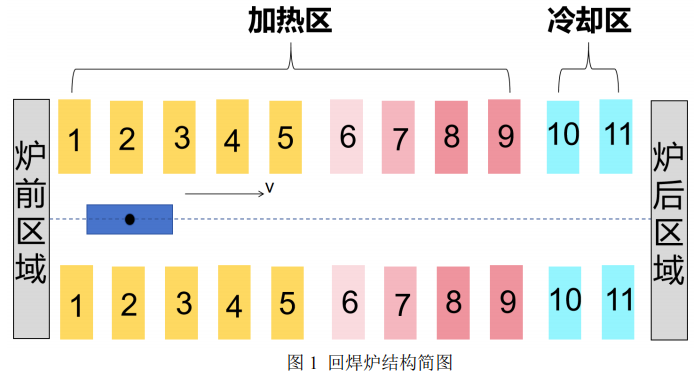
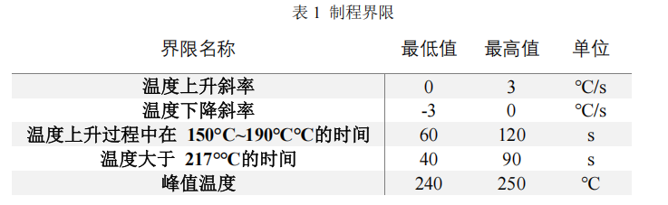

# 基于一维热传导方程的炉温曲线机理模型

## 摘要

在电子产品生产中，精确控制回焊炉温度以实现自动焊接电子元件到印刷电
路板上是至关重要的。本文的研究集中在回焊炉各温区温度和传送带速度对炉温
曲线的影响，通过建立基于热传导方程与牛顿冷却定律的温度分布模型来探索这
些关系。

针对问题一，本文首先深入研究了炉前、炉后以及间隙区域的温度分布。为
了准确描述这些区域的温度变化，采用了热传导方程并制定了相应的边界条件。
然而，通过实验验证发现，基于牛顿冷却定律的简化模型在相同时间段内能够更
好地拟合实际数据，因此选择了这种简化模型作为进一步研究的基础。模型参数
的识别过程则利用了实验数据，分析得出不同温区的动态变化规律，通过最小二
乘法确定了各温区的冷却系数，确保模型的准确性和适用性。

针对问题二，本文建立了以最大过炉速度为目标的单目标优化模型。约束条
件包括满足问题一中建立的微分方程模型和工艺要求的制程界限。为了有效求解
优化模型，采用了二分法，最终得出了最大传输速度为 76.2980 cm/min 的结果。
这表明通过优化回焊炉温度和传送带速度的组合，可以最大化生产效率，同时保
证产品质量和制程稳定性。

针对问题三，本文进一步探索了衡量累计高温区域大小所对应的阴影面积最
小化的目标。基于各温区的问题和过炉速度作为决策变量，建立了优化模型。为
了找到最小阴影面积，采用了变步长搜索法，这种方法有效地在复杂的多变量空
间中寻找到了最优解，进一步提升了生产过程中的效率和品质。

针对问题四，本文着眼于高温区炉温曲线的对称性及高温累计区域面积两个
指标。首先定义了高温区炉温曲线对称性指标，并基于此建立了双目标规划模型，
以同时考虑这两个目标。为了将多目标优化转化为单目标优化，采用了动态综合
加权法，最终得出在尽量对称的情况下达到最小阴影面积的结果。

关键词：热传导方程、牛顿冷却定律、最小二乘法、变步长搜索法

## 问题背景

在集成电路板等电子产品的生产过程中，回焊炉的使用至关重要。回焊
炉是一种通过加热将安装有各种电子元件的印刷电路板上的焊料熔化，使电
子元件自动焊接到电路板上的设备。回焊炉的内部设置有多个温区，这些温
区从功能上分为四个大温区：预热区、恒温区、回流区和冷却区。每个大温
区内部又划分为若干小温区。这些温区的温度控制对焊接过程的质量有显著
影响，如下图所示：

生产过程中，温度传感器会监测焊接区域中心的温度变化，这些数据被
称为炉温曲线。炉温曲线反映了焊接区域中心温度随时间的变化情况，对产
品质量有重要影响。为了确保焊接质量，可以通过调整各温区的设定温度和
传送带的过炉速度来控制产品质量。

在本题中，回焊炉内有 11 个小温区及炉前区域和炉后区域，每个小温区
的长度为 30.5 cm，相邻小温区之间有 5 cm 的间隙，炉前区域和炉后区域的
长度均为 25 cm。设某次实验的温度分别为 175ºC（小温区 1~5）、 195ºC
（小温区 6）、235ºC（小温区 7）、255ºC（小温区 8~9）及 25ºC（小温 区
10~11）；传送带过炉速度为 70 cm/min；焊接区域的厚度为 0.15 mm。实际
生产中，可以在此基础上，一定范围内对温区温度、传送带过炉速度等进行
调整，以控制产品品质。同时，在回焊炉电路板焊接过程中，炉温曲线需满
足一定的要求，称为制程界限，如表 1。

## 问题提出

- 问题 1：建立焊接区域温度变化的数学模型。在给定传送带速度和温区设定
温度的条件下，计算焊接区域中心温度的变化情况，绘制相应的炉温曲线，并记
录特定时间间隔的温度数据。问题要求：传送带过炉速度为 78 cm/min，各温区
温度的设定值分别为 173ºC（小温区 1~5）、198ºC（小温区 6）、230ºC（小温
区 7）和 257ºC（小温区 8~9）。
- 问题 2：在设定各温区温度的情况下，确定允许的最大传送带过炉速度，使
焊接过程满足制程界限的要求。问题要求：各温区温度的设定值分别为 182ºC（小
温区 1~5）、203ºC（小温区 6）、237ºC（小温区 7）、254ºC（小温区 8~9）。
- 问题 3：优化炉温曲线，使焊接区域中心温度超过 217ºC 到峰值温度的时间
面积最小。通过调整各温区的设定温度和传送带速度，找到最优方案并计算该面
积。
- 问题 4：在满足问题 3 要求的基础上，进一步优化炉温曲线，使以峰值温度
为中心线的两侧超过 217ºC 的炉温曲线尽量对称。结合对称性的要求，确定最
优的炉温曲线、各温区设定温度及传送带速度，并给出相应的指标值。
